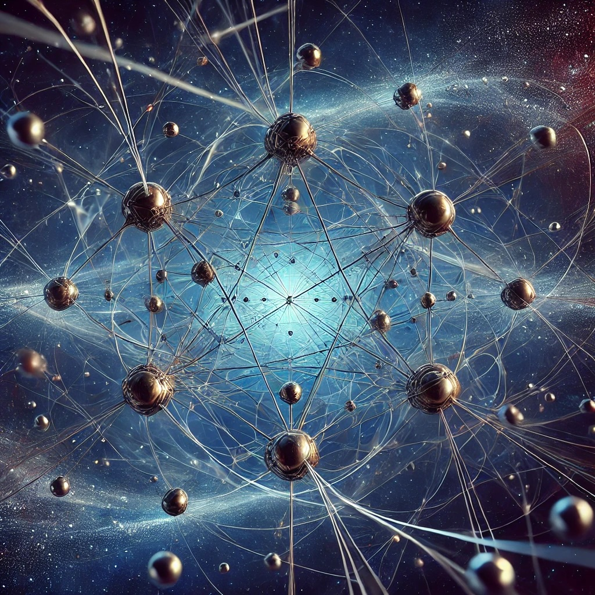

{: .align-right width="300px"}
I am a final year graduate student at ECNU.

My research interests are in tensor network and quantum many-body systems.

I am currently working towards my Master's Thesis in the field of Quantum Criticality and complex thermodynamics.

Future
---
I am applying for a phD position in Physics overseas.
